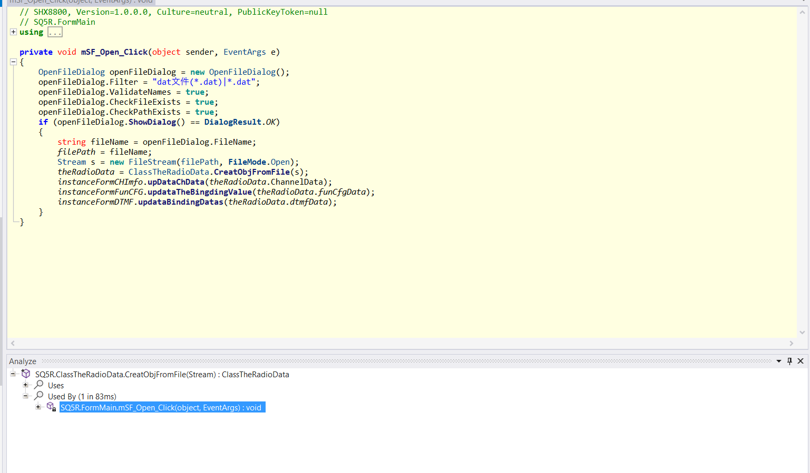
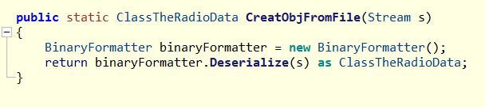
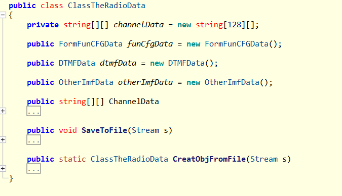

首先观察反编译后的软件是如何对已保存的文件进行读取的：

由于这个软件开发者编写代码习惯比较良好，命名规范，很容易定位到Open_Click这个点击相关函数符合我们的需求：

其中调用了CreateObjFromFile这个函数：

这个函数直接反序列化输入文件流到一个ClassTheRadioData对象。这个对象具体包含：

理论上我们只需要使用C#相同的反序列化方式即可解析这些数据。但是go没有现成的轮子，所以我用c#搓了一个二进制和json互转的工具，详见[工具](../lib/readme.md)

