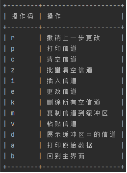

# README

 
 

该工具用于调整森海克斯8800官方写频工具生成文件的信道信息。

理论上该工具可在Linux/macOS/Windows上使用，但仅在Windows 10/ Windows 8上测试通过。其他操作系统尚未验证。

官方写频文件无法调整信道顺序以及批量删除空信道，这一工具提供了这些功能。

### 功能

## 安装

### 手动安装

如果有go和C#基础，可以选择手动编译。

首先编译lib/tranz.cs。这一文件的用途详见lib目录下的readme。假设编译完成后该可执行文件的路径为`C:/a/SHX8800.exe`

然后编译main.go。使用以下命令：**go build -tags="dev"** 

这一命令不会内嵌C#插件，即SHX8800.exe。 如果使用**go build -tags="release"**, 则需要把SHX8800.exe放在pkg/filetools下才能编译。这一编译产物较dev增加自动释放SHX800.exe功能，但是体积会大得多！c#编译产物太大了没办法

编译完成后，使用`main.exe --dep-path C:/a/SHX8800.exe`运行。

### 直接运行

也可以直接下载release中的编译产物(shx8800-config-editor-release_xxx_.exe)，直接运行"shx8800-config-editor-release_xxx_.exe",按照指示操作。

更多功能，请使用`shx8800-config-editor-release_xxx_.exe --help`

## 其他...

在成功保存编辑结果后，可以在官方写频软件中打开输出的.dat文件，确认结果无误后，照常写入对讲机即可。

**警告：请勿过度依赖该软件！对使用该软件所造成的一切后果作者不承担任何责任！**

## 许可证

本软件使用Unlicense许可证。
